# 🧠 Cognitive Forge: Visual Architecture

These diagrams illustrate how the Cognitive Forge framework organizes reasoning, memory, and agent collaboration.

---

## 1. Agent Collaboration Flow

```mermaid
flowchart TD
    UserPrompt["🗣️ User Prompt"]
    Gatekeeper["🧱 Gatekeeper"]
    Thresholder["⚖️ Thresholder"]
    Weaver["🧵 Weaver"]
    Artisan["🎨 Artisan"]
    MetaObserver["👁️ Meta Observer"]
    Output["📤 Output"]

    UserPrompt --> Gatekeeper
    Gatekeeper --> Thresholder
    Thresholder --> Weaver
    Weaver --> Artisan
    Artisan --> Output

    MetaObserver --> Gatekeeper
    MetaObserver --> Weaver
    Output --> MetaObserver
```

---

## 2. Memory Geometry Visualizations

### 🔁 Spiral Loop Memory

A looped structure where recent tokens wrap around and revisit prior checkpoints with each iteration. Useful for recursive reflection and narrative pattern building.

### 📼 Linear Tape Memory

Sequential token access. Ideal for historical replay, stepwise logic, and deterministic traceability.

---

## 3. Protocol Flow: Reasoning Chain

```mermaid
flowchart LR
    Start(["🔍 Start Reasoning"])
    Gatekeeper["🧱 Gatekeeper"]
    Thresholder["⚖️ Thresholder"]
    Weaver["🧵 Weaver"]
    Artisan["🎨 Artisan"]
    MetaObserver["👁️ Meta Observer"]
    Output["📤 Output"]

    Start --> Gatekeeper
    Gatekeeper -->|Accept| Thresholder
    Gatekeeper -->|Reject| MetaObserver
    Thresholder -->|Simple| Artisan
    Thresholder -->|Complex| Weaver
    Weaver --> Artisan
    Artisan --> Output
    Output --> MetaObserver
```

---

## 4. How Geometries Affect Flow

Memory geometries dynamically alter how agents interact and prioritize:

- **Spiral Loop** encourages cyclic revisitation — useful for deep reasoning and metaphoric pattern-matching. The MetaObserver may prompt the Weaver to reinterpret past reasoning.
- **Linear Tape** enforces strict sequential flow — ideal for deterministic tasks. Gatekeeper uses tape to ensure no circular logic.
- **Torus Buffer** supports short-term rotational memory — ideal for looping prompts or summarization.
- **Fractal Archive** enables hierarchical recall — allowing agents like Weaver or Artisan to drill into nested knowledge when needed.

Each geometry changes how memory is retrieved and how often the MetaObserver intervenes. Flow isn't static — it flexes based on geometry selected.

---

## 5. Agent Flow with Torus Buffer Memory

In a toroidal memory geometry, agents operate with access to a rotational buffer. This allows them to revisit recent ideas without strict linearity or recursion.

```mermaid
flowchart TD
    UserPrompt["🗣️ User Prompt"]
    Gatekeeper["🧱 Gatekeeper"]
    Thresholder["⚖️ Thresholder"]
    Weaver["🧵 Weaver"]
    Artisan["🎨 Artisan"]
    MetaObserver["👁️ Meta Observer"]
    Output["📤 Output"]
    MemoryRing["🔄 Torus Memory Buffer"]

    UserPrompt --> Gatekeeper
    Gatekeeper --> Thresholder
    Thresholder --> Weaver
    Weaver --> Artisan
    Artisan --> Output

    Gatekeeper --> MemoryRing
    Weaver --> MemoryRing
    Artisan --> MemoryRing
    MetaObserver --> MemoryRing

    MemoryRing --> Gatekeeper
    MemoryRing --> Weaver
    MemoryRing --> Artisan
    Output --> MetaObserver
```

Here, the **MemoryRing** enables lateral jumps between recent thoughts, encouraging reiteration without redundancy — perfect for real-time summarization, creativity loops, and adaptive writing.

---

## 6. Agent Flow with Hexagonal Processing Hub

In the **Hexagon Memory Geometry**, agents surround a shared processing core and interact in a network of equidistant links. This is ideal for high-bandwidth parallelism, feedback loops, and distributed consensus.

```mermaid
graph TB
    subgraph Hexagon
        Core["🧠 Shared Processing Hub"]
        Gatekeeper["🧱 Gatekeeper"]
        Thresholder["⚖️ Thresholder"]
        Weaver["🧵 Weaver"]
        Artisan["🎨 Artisan"]
        MetaObserver["👁️ Meta Observer"]
        MemoryAgent["🧬 MemoryAgent"]
    end

    Gatekeeper -- Access --> Core
    Thresholder -- Complexity Signal --> Core
    Weaver -- Pattern Injection --> Core
    Artisan -- Output Draft --> Core
    MetaObserver -- Oversight Feedback --> Core
    MemoryAgent -- Recall/Insert --> Core

    Core --> Gatekeeper
    Core --> Thresholder
    Core --> Weaver
    Core --> Artisan
    Core --> MetaObserver
    Core --> MemoryAgent
```

In this model, **all agents work simultaneously**, contributing insights, oversight, or data to the core. The geometry supports ultra-fast feedback cycles and is well-suited for collaborative reasoning, autonomous decision-making, and consensus-building.

---

## 7. Agent Flow with Pentagon Control Ring

In the **Pentagon Geometry**, each agent links to exactly two neighbors, forming a continuous control loop. One node is always passing off to the next in sequence. This supports strict oversight, decision locking, and rotational turn-taking.

```mermaid
flowchart LR
    Gatekeeper["🧱 Gatekeeper"] --> Thresholder["⚖️ Thresholder"]
    Thresholder --> Weaver["🧵 Weaver"]
    Weaver --> Artisan["🎨 Artisan"]
    Artisan --> MetaObserver["👁️ Meta Observer"]
    MetaObserver --> Gatekeeper
```

This geometry creates a **closed feedback circuit** where control and insight rotate between agents. It’s ideal for:

- Formal evaluation cycles
- Chain-of-command decision making
- Deliberate step-by-step protocols

It trades parallel speed for serial rigor — better for **governance**, **alignment audits**, or **debate-style reasoning**.

---

## 8. Hexagon vs. Pentagon Behavior Comparison

| Feature             | Hexagon Hub                          | Pentagon Ring                            |
| ------------------- | ------------------------------------ | ---------------------------------------- |
| Agent Interaction   | Parallel access to shared core       | Sequential rotation among peers          |
| Processing Style    | Collaborative, simultaneous updates  | Controlled, turn-based handoff           |
| Feedback Cycle      | Instantaneous multi-agent sync       | Continuous, slow-loop validation         |
| Ideal For           | Consensus-building, creative sprints | Governance, audits, rule enforcement     |
| Memory Integration  | Centralized, real-time shared state  | Decentralized, stage-by-stage memory use |
| Risk                | Overlap/collision in noisy inputs    | Bottlenecks or deadlock under pressure   |
| Oversight Structure | MetaObserver can observe all at once | MetaObserver acts in its turn            |

Each structure suits different reasoning goals. Hybrid models may fuse their properties depending on task profile and stability requirements.

